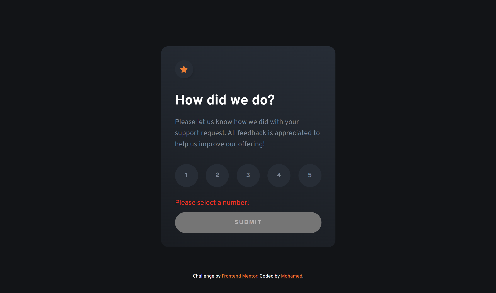

# Frontend Mentor - Interactive rating component solution

This is a solution to the [Interactive rating component challenge on Frontend Mentor](https://www.frontendmentor.io/challenges/interactive-rating-component-koxpeBUmI). Frontend Mentor challenges help you improve your coding skills by building realistic projects.

## Table of contents

- [Overview](#overview)
  - [The challenge](#the-challenge)
  - [Screenshot](#screenshot)
  - [Links](#links)
- [My process](#my-process)
  - [Built with](#built-with)
  - [What I learned](#what-i-learned)
  - [Continued development](#continued-development)
- [Author](#author)
- [Acknowledgments](#acknowledgments)

## Overview

### The challenge

Users should be able to:

- View the optimal layout for the app depending on their device's screen size
- See hover states for all interactive elements on the page
- Select and submit a number rating
- See the "Thank you" card state after submitting a rating

### Screenshot





### Links

- Solution URL: [Solution](https://www.frontendmentor.io/solutions/interactive-rating-component-bcbOyVzvhw)
- Live Site URL: [Live](https://fementor-rating-component.netlify.app/)

## My process

### Built with

- Semantic HTML5 markup
- CSS custom properties
- Flexbox
- Mobile-first workflow
- Vanilla JavaScript

### What I learned

I was trying to use module (export and import) to send the selected value to another JS file but that was overwhelming so instead I used (session storage),
which helped me achieve what i want in a smooth dynamic way!

and im so happy with this code that i wrote

```js
const numbersArray = Array.from(
  document.querySelectorAll(`#mainCard ul li label`)
);
const form = document.querySelector(`form`);
let rate = 0;
form.addEventListener(`click`, (e) => {
  if (e.target.classList.contains(`label`)) {
    if (e.target.classList.contains(`active`)) {
      e.target.classList.remove(`active`);
      window.sessionStorage.removeItem(`rate`);
    } else {
      numbersArray.forEach((number) => {
        number.classList.remove(`active`);
      });
      e.target.classList.add(`active`);
      rate = e.target.dataset.value;
      window.sessionStorage.setItem(`rate`, rate);
    }
  }
});
```

### Continued development

I will start getting some more information about module (import and export) as I felt uncomfortable with using them with different file locations

## Author

- Website - [Mohamed](https://www.mohamed-dev.netlify.app)
- Frontend Mentor - [@midoashraf010](https://www.frontendmentor.io/profile/midoashraf010)

## Acknowledgments

The most usefull tip I've heard is taking the problem and dividing it to smaller problems, this approach makes it easier for you to approach solutions and make things work!

### Outro

Thank you for reading! I hope you found the code usefull.
